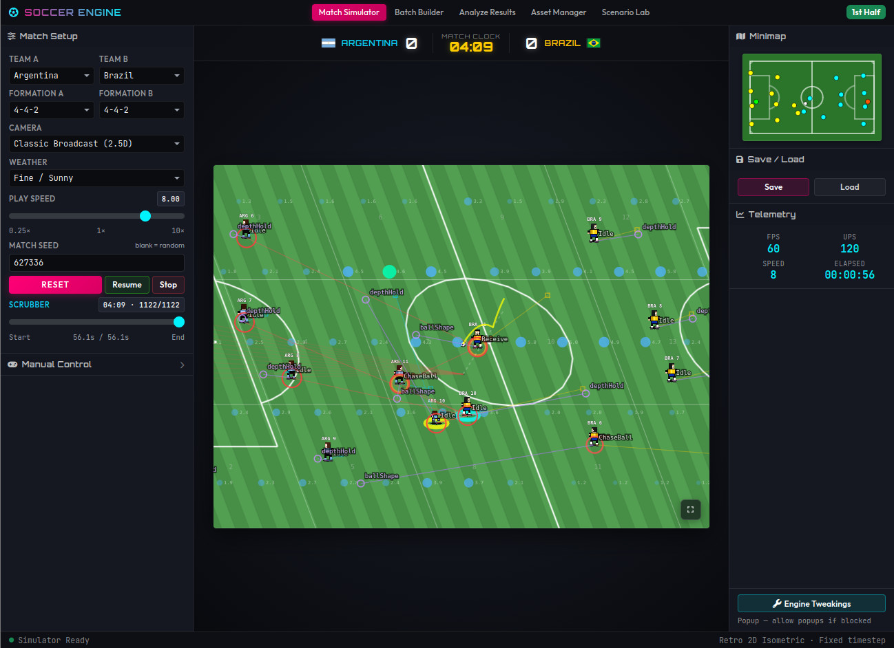
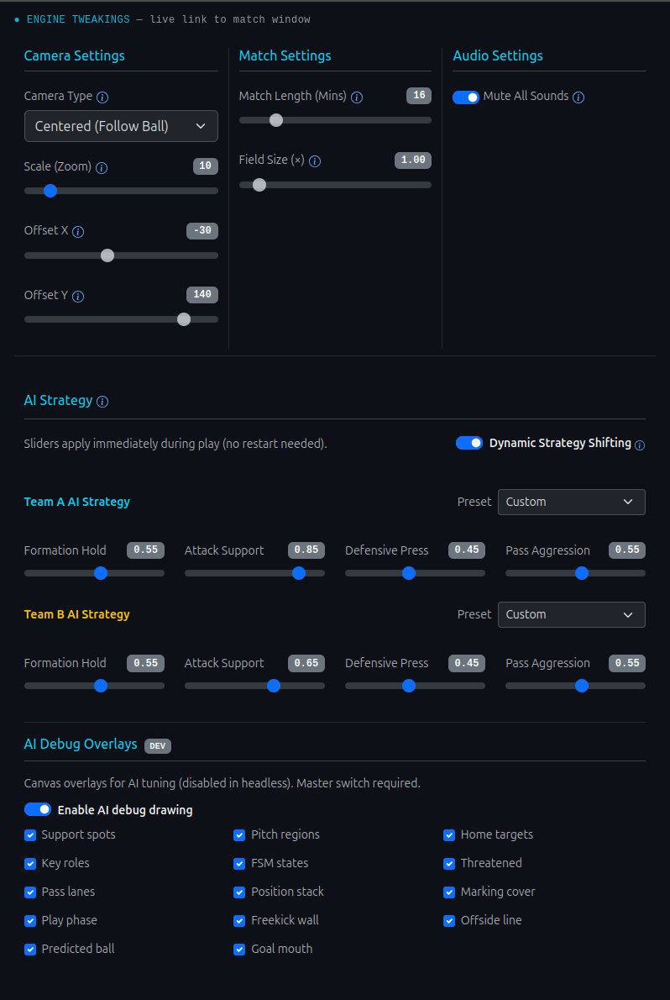

# Soccer Engine (soccer-js)

A **retro 2D isometric soccer game engine** written in JavaScript. It simulates full matches with team AI, set pieces, match rules, and optional human control — runnable in the browser or headlessly in Node.js for batch balance testing.



## 📺 Video Demo
Check out this Open Source Soocer Game Engine in action:

[](https://youtu.be/yWp9vSJbrzU)

## Features

- **Fixed-timestep match simulation** — logic at 20 UPS, render at 60 FPS; seeded LCG for deterministic AI-only runs
- **Team & player AI** — formations, roles, support spots, pass safety, through balls, marking, counter-press, set-piece playbooks
- **Match rules** — kick-off, goals, throw-ins, corners, free kicks, penalties, offside (delayed), substitutions
- **Isometric canvas rendering** — modular sprites, flags, audio hooks, debug overlays
- **Manual control** — take over a player while AI runs the rest
- **Headless batch runner** — multi-worker simulations, telemetry, parameter sweeps
- **Scenario Lab** — isolated set-piece / open-play situations for interactive testing
- **Asset Manager** — browse and work with sprite / palette assets

## Requirements

- **Node.js** 18+ (recommended)
- A modern browser for the UI apps

## Quick start

```bash
# Install build tools (esbuild, sass)
npm install

# Build JS bundle + CSS
npm run build

# Serve the project (static HTTP on port 8080)
npm run dev
```

Then open:

| App | URL |
| :--- | :--- |
| Match Simulator | http://localhost:8080/html/index.html |
| Batch Builder | http://localhost:8080/html/batch-builder.html |
| Simulation Analysis | http://localhost:8080/html/simulation-analysis.html |
| Asset Manager | http://localhost:8080/html/asset-manager.html |
| Scenario Lab | http://localhost:8080/html/tests.html |

Root `index.html` redirects to `/html/`.

## Project layout

```text
kernel/
  core/entities/     # Ball, Player, Team, Pitch, Goal, FSMs
  core/lib/          # AI, rules, steering, sprites, scenarios, …
  providers/simulator/  # Match flow, headless runner
  apps/              # Browser app entry points
  engine.js          # Canvas / application loops
  settings.js        # Physics, AI knobs, flags
html/                # UI pages
presets/             # Formations, AI params, palettes, stats (JSON)
assets/              # Sprites, flags, sounds
scripts/             # Batch sim, profile, param sweep CLIs
tests/               # Node unit / integration tests
docs/                # Architecture & subsystem docs
build/               # Generated app.bundle.js + CSS (do not edit)
```

## Scripts

| Command | Description |
| :--- | :--- |
| `npm run build` | Build CSS and browser JS bundle |
| `npm run build:js` / `build:css` | Build only JS or only CSS |
| `npm run dev` | Static server on port 8080 |
| `npm test` | Full test suite (quiet on success) |
| `npm run test:<name>` | Single suite, e.g. `test:pass-safety` |
| `npm run sim:batch` | Headless batch matches |
| `npm run sim:sweep` | Sweep one AI parameter |
| `npm run sim:profile` | Profile a batch run |

Verbose test output:

```bash
VERBOSE=1 npm run test:pass-safety
# or
VERBOSE=1 node tests/pass_safety.js
```

### Headless batch example

```bash
npm run sim:batch -- '{"iterations":10,"seed":42,"headless":true}'
```

Outputs land under `simulations/output/`. For very large runs, prefer `SIMULATION.sh` and run it locally.

### Parameter sweep example

```bash
npm run sim:sweep -- '{"knob":"PASS_AGGRESSION","min":0.1,"max":0.9,"steps":5}'
```

## Determinism

Match bootstrap and logic steps use a **seeded LCG** bound to `Math.random` only during `bootstrapMatch` / `updateAll` (and Scenario Lab apply). Same seed and no human input → same AI match. Manual control, wall-clock scheduling of human input, and non-seeded UI code intentionally diverge after that.

Physics and AI knobs live in `kernel/settings.js` (`Settings.physics`, `Settings.AI`) so balance tweaks stay in one place.



## Documentation

Deep dives for contributors and agents:

| Doc | Topics |
| :--- | :--- |
| [docs/01_architecture.md](docs/01_architecture.md) | Hierarchy, fixed timestep, determinism, physics |
| [docs/02_ai_and_match.md](docs/02_ai_and_match.md) | Player AI, passes, FSMs, set pieces |
| [docs/03_rendering_assets.md](docs/03_rendering_assets.md) | Canvas, isometric draw, sprites, audio |
| [docs/04_simulation.md](docs/04_simulation.md) | Headless batch, telemetry, Scenario Lab, tests |
| [docs/05_spritesheet.md](docs/05_spritesheet.md) | Sprite sheet format |

## License

This project is licensed under the [MIT License](LICENSE).

Copyright (c) 2026 Thiago Campos Viana

---

## 🌐 Connect with Me

Stay updated with my projects, coding sessions, and videos:

- **YouTube**: [tcviana](https://www.youtube.com/tcviana)
- **X (formerly Twitter)**: [@haeretici](https://x.com/haeretici)

---

## 💖 Support the Project (Crypto Donations)

If you find this project useful and would like to support its development, you can make a cryptocurrency donation to the following addresses:

* **BNB Chain / Ethereum / Polygon / OP / Linea / Base / Arbitrum (EVM)**:  
  `0xfE5Fc67Fe92234cB079B521EC7f9ad9c23da2AA8`

* **Solana (SOL)**:  
  `EjPqM1cX5nhkqdb7GK7z5aF9ayRswPUwPd5VnVP1PVVL`

* **Tron (TRX)**:  
  `TP3Ncy8RVYKJPkVBbrrMD8WsDmPkRCLArG`

* **Bitcoin (BTC)**:  
  `bc1qqk5s3rmvxe3mlhtzr07xnp44ap6yu95ksva703`
